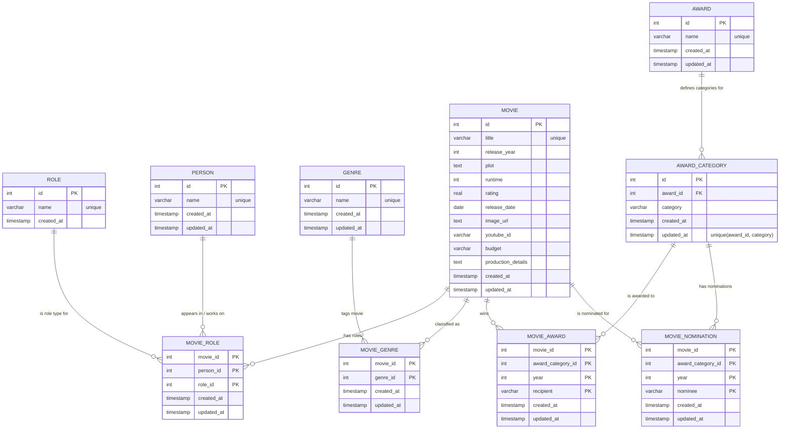

```mermaid
erDiagram
    ROLE {
        int id PK
        varchar name "unique"
        timestamp created_at
    }

    PERSON {
        int id PK
        varchar name "unique"
        timestamp created_at
        timestamp updated_at
    }

    GENRE {
        int id PK
        varchar name "unique"
        timestamp created_at
        timestamp updated_at
    }

    MOVIE {
        int id PK
        varchar title "unique"
        int release_year
        text plot
        int runtime
        real rating
        date release_date
        text image_url
        varchar youtube_id
        varchar budget
        text production_details
        timestamp created_at
        timestamp updated_at
    }

    MOVIE_ROLE {
        int movie_id PK
        int person_id PK
        int role_id PK
        timestamp created_at
        timestamp updated_at
    }

    MOVIE_GENRE {
        int movie_id PK
        int genre_id PK
        timestamp created_at
        timestamp updated_at
    }

    AWARD {
        int id PK
        varchar name "unique"
        timestamp created_at
        timestamp updated_at
    }

    AWARD_CATEGORY {
        int id PK
        int award_id FK
        varchar category
        timestamp created_at
        timestamp updated_at
        "unique(award_id, category)"
    }

    MOVIE_AWARD {
        int movie_id PK
        int award_category_id PK
        int year PK
        varchar recipient PK
        timestamp created_at
        timestamp updated_at
    }

    MOVIE_NOMINATION {
        int movie_id PK
        int award_category_id PK
        int year PK
        varchar nominee PK
        timestamp created_at
        timestamp updated_at
    }

    %% Relationships / cardinality
    MOVIE ||--o{ MOVIE_ROLE : "has roles"
    PERSON ||--o{ MOVIE_ROLE : "appears in / works on"
    ROLE ||--o{ MOVIE_ROLE : "is role type for"

    MOVIE ||--o{ MOVIE_GENRE : "classified as"
    GENRE ||--o{ MOVIE_GENRE : "tags movie"

    AWARD ||--o{ AWARD_CATEGORY : "defines categories for"
    AWARD_CATEGORY ||--o{ MOVIE_AWARD : "is awarded to"
    MOVIE ||--o{ MOVIE_AWARD : "wins"

    AWARD_CATEGORY ||--o{ MOVIE_NOMINATION : "has nominations"
    MOVIE ||--o{ MOVIE_NOMINATION : "is nominated for"
```

